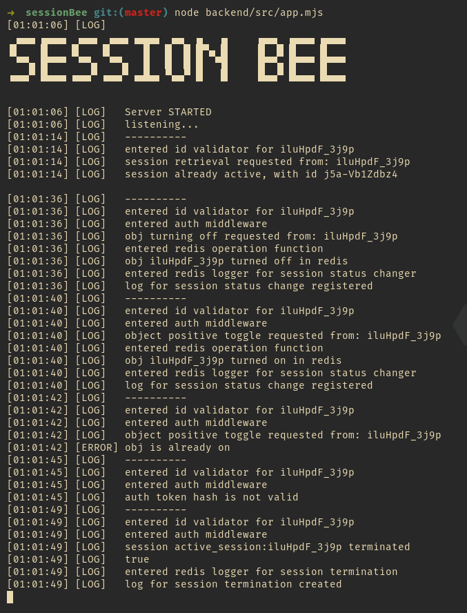

# sessionBee - a "microservicy" session handler API 

# what is it? 
sessionBee is what the name says, it is a session handler api [italian word api is translated in bees, *pun intended*].
While it is modeled as a microservice it lacks some fundamentals like strong auth and complete independence from other services, 
here's the "servicy" in the title. 

# what technology stack it uses? 
sessionBee is built on top of Node.Js (express.js) and it uses Redis to store sessions and logs. 

# what does it do? 
When an e-obj is turned on it can establish a connection with the session handler (that is intended to communicate with other services to provide further interactions with the given obj).
Every e-obj (for instance a smart-radio) is provided with an identifier (nano-id is used instead of uuids) for the object and an identifier for the vendor (or other brand-specific info).
As a proof of concept the session simulation is a toggler that simulates a bit flip [it sets on and off the object]. 

# about session duration 
For the moment sessions can only be terminated by api calls or removing them from redis table, in a real world use-case one should add a timeout for a session. 

# can it scale? 
Even though it has not been tested at scale [being a demo] it has been designed with scalability in mind. It should be kinda scalable since it has really simple logic and it relies on top of scalable tech like Redis.
This does not mean that it can *ever* be considered anything like a production-ready software. 

